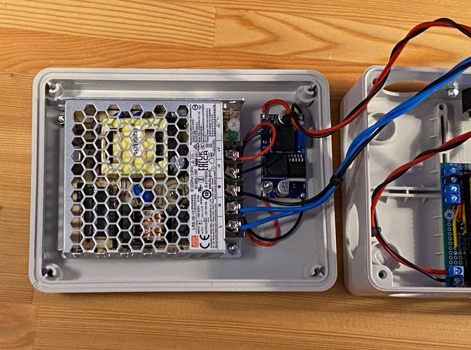
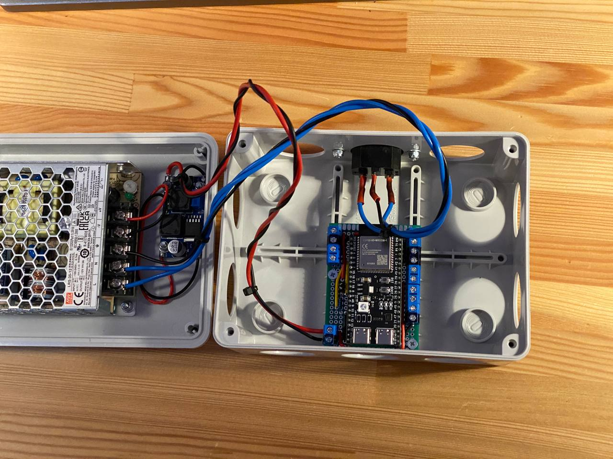
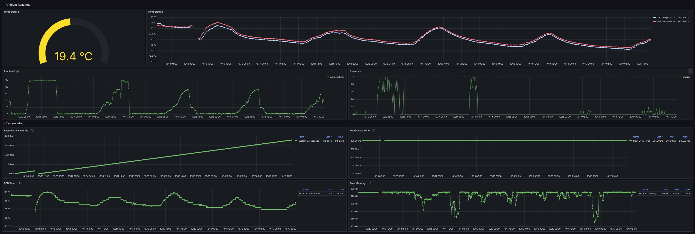

# FlexNode

FlexNode is a DIY "smart home" system with a single hub and multiple flexible and customizable nodes.

## System Diagram

### Node proof of concept

Some images during building:

Grafana screenshots showing it in action:

